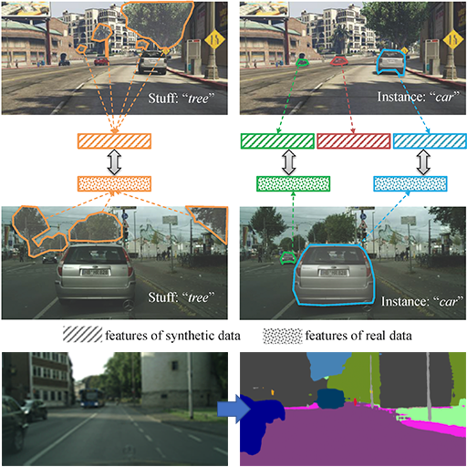
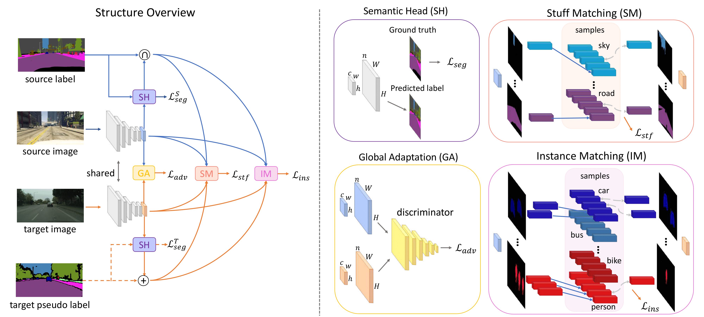
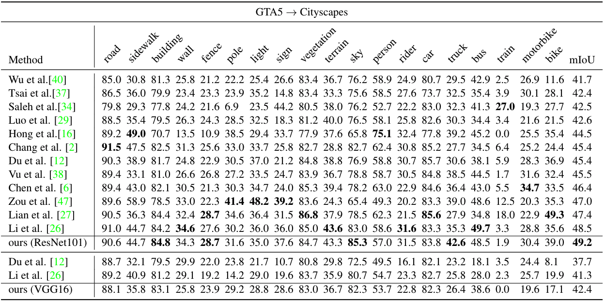
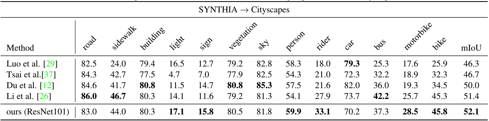
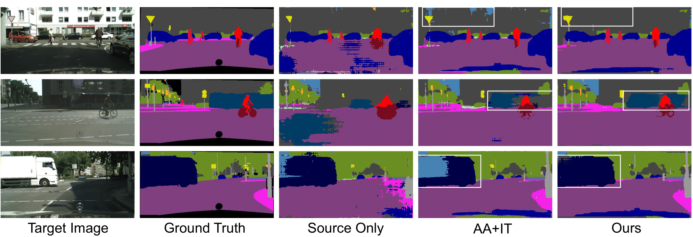

# Differential Treatment for Stuff and Things: A Simple Unsupervised Domain Adaptation Method for Semantic Segmentation

This repository is for Stuff Instance Matching (SIM) framework introduced in the following paper accepted by CVPR2020

**[Differential Treatment for Stuff and Things: A Simple Unsupervised Domain Adaptation Method for Semantic Segmentation](https://arxiv.org/abs/2003.08040)**  
[Zhonghao Wang](https://scholar.google.com/citations?user=opL6CL8AAAAJ&hl=en),
[Mo Yu](https://sites.google.com/site/moyunlp/),
[Yunchao Wei](https://weiyc.github.io/),
[Rogerio Feris](http://rogerioferis.com/),
[Jinjun Xiong](https://scholar.google.com/citations?user=tRt1xPYAAAAJ&hl=en),
[Wen-mei Hwu](https://scholar.google.com/citations?user=ohjQPx8AAAAJ&hl=en),
[Thomas S. Huang](https://scholar.google.com/citations?user=rGF6-WkAAAAJ&hl=en),
and [Humphrey Shi](https://www.humphreyshi.com/)

<div align="center">
  
</div>


## Introduction

We consider the problem of unsupervised domain adaptation for semantic segmentation by easing the domain shift between the source domain (synthetic data) and the target domain (real data) in this work. State-of-the-art approaches prove that performing semantic-level alignment is helpful in tackling the domain shift issue. Based on the observation that stuff categories usually share similar appearances across images of different domains while things (i.e. object instances) have much larger differences, we propose to improve the semantic-level alignment with different strategies for stuff regions and for things: 1) for the stuff categories, we generate feature representation for each class and conduct the alignment operation from the target domain to the source domain; 2) for the thing categories, we generate feature representation for each individual instance and encourage the instance in the target domain to align with the most similar one in the source domain. In this way, the individual differences within thing categories will also be considered to alleviate over-alignment. In addition to our proposed method, we further reveal the reason why the current adversarial loss is often unstable in minimizing the distribution discrepancy and show that our method can help ease this issue by minimizing the most similar stuff and instance features between the source and the target domains. We conduct extensive experiments in two unsupervised domain adaptation tasks, i.e. GTA5 to Cityscapes and SYNTHIA to Cityscapes, and achieve the new state-of-the-art segmentation accuracy.

<div align="center">
  
  Training framework
</div>


## Prerequisites

Download our repo:
```
git clone https://github.com/SHI-Labs/Unsupervised-Domain-Adaptation-with-Differential-Treatment.git
cd Unsupervised-Domain-Adaptation-with-Differential-Treatment
```

### Data preparation

Download [Cityscapes](https://www.cityscapes-dataset.com/), [CycleGAN transferred GTA5](https://drive.google.com/open?id=1OBvYVz2ND4ipdfnkhSaseT8yu2ru5n5l) and [gta5 labels](https://drive.google.com/file/d/11E42F_4InoZTnoATi-Ob1yEHfz7lfZWg/view?usp=sharing). Symbolic link them under ```data``` folder:
```
ln -s path_to_Cityscapes_folder ./data/Cityscapes
ln -s path_to_gta5_deeplab_folder ./data/gta5_deeplab
ln -s path_to_gta5_labels_folder ./data/gta5_deeplab/labels
```

### Environment setup

The code is built on Ubuntu 18.04 environment with CUDA 10.0 and cuDNN 7.6.5, and it is trained and tested with a Nvidia Rtx 2080Ti GPU.

Create a new conda environment and install dependencies:
```
conda create -n simenv python=3.7
conda activate simenv
pip install -r requirements.txt
```
Please install apex from the [official repo](https://github.com/NVIDIA/apex). 

## Train

### First phase

Train the SIM model:
```
python train_sim.py
```

### Second phase
Generate the sudo labels for Cityscapes training set:
```
python SSL.py
```
Train SIM with self-supervised learning:
```
python train_sim_ssl.py
```

## Test
Test the final model:
```
./eva.sh snapshots_ssl/BestGTA5.pth
```

Test the SIM model without self-supervised training:
```
./eva.sh snapshots/BestGTA5.pth
```

## Results

<div align="center">
  
  
  Comparison to the state-of-the-art results of adapting GTA5 to Cityscapes.
</div>

<div align="center">
  
  
  Comparison to the state-of-the-art results of adapting SYNTHIA to Cityscapes.
</div>

## Visual results

<div align="center">
  
  Visualization of the segmentation results.
</div>

## Citation

```
@InProceedings{Wang_2020_CVPR,
author = {Wang, Zhonghao and Yu, Mo and Wei, Yunchao and Feris, Rogerio and Xiong, Jinjun and Hwu, Wen-mei and Huang, Thomas S. and Shi, Honghui},
title = {Differential Treatment for Stuff and Things: A Simple Unsupervised Domain Adaptation Method for Semantic Segmentation},
booktitle = {The IEEE/CVF Conference on Computer Vision and Pattern Recognition (CVPR)},
month = {June},
year = {2020}
}
@InProceedings{Wang_2020_CVPR_Workshops,
author = {Wang, Zhonghao and Wei, Yunchao and Feris, Rogerio and Xiong, Jinjun and Hwu, Wen-mei and Huang, Thomas S. and Shi, Honghui},
title = {Alleviating Semantic-Level Shift: A Semi-Supervised Domain Adaptation Method for Semantic Segmentation},
booktitle = {The IEEE/CVF Conference on Computer Vision and Pattern Recognition (CVPR) Workshops},
month = {June},
year = {2020}
}
```

## Acknowledgements

This code is developed on the code base of [AdaptSegNet](https://github.com/wasidennis/AdaptSegNet) and utilizes the CycleGAN transferred target images released by [BDL](https://github.com/liyunsheng13/BDL). Many thanks to the authors of these works. 
